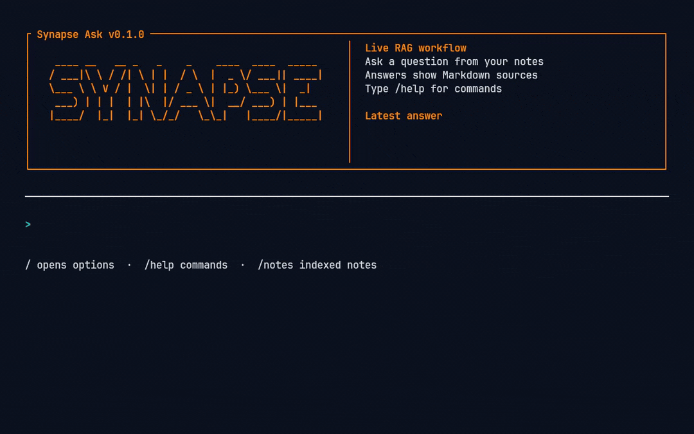
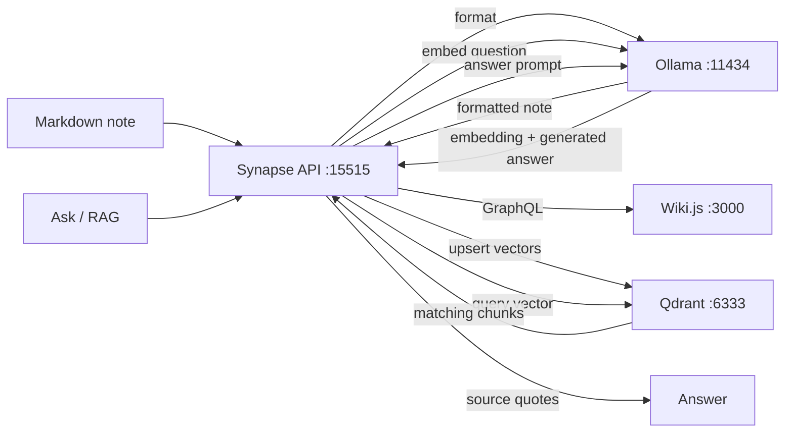

# Synapse

> Self-hosted AI notes automation lab that turns Markdown notes into a private searchable knowledge base.

[](https://github.com/max-vie/synapse/actions/workflows/ci.yml)
[](LICENSE)
[](docs/SETUP.md#live-local-lab-flow)
[](docs/SETUP.md#environment-files)
[](docs/ARCHITECTURE.MD#service-roles)
[](docs/ARCHITECTURE.MD#service-roles)



## Project overview

Synapse is a small local infrastructure lab for testing an AI-assisted notes workflow. It focuses on three things:

- running the stack locally with Docker Compose;
- connecting Markdown notes to a RAG workflow;
- proving the result with scripts, logs, and evidence.

## Quick lab flow

The local lab is a three-step flow because Wiki.js requires manual first-run admin setup and API-token creation:

```bash
make lab-up
make configure
make proof
```

`make lab-up` starts the FastAPI Synapse service, Qdrant, Ollama, and Wiki.js. It does not mean the proof-ready lab is fully configured. After it starts, open Wiki.js, enable the Wiki.js API in the Administration Area, create a page-capable API token, save it in private `.env`, then run `make configure` to check the token and live API before `make proof`.

The reviewer demo is separate and only runs when explicitly called:

```bash
make demo
```

More detail: [Setup guide](docs/SETUP.md). For the short command list, run:

```bash
make help
```

## Workflow



## Docs

- [Setup](docs/SETUP.md)
- [Architecture](docs/ARCHITECTURE.MD)
- [Version policy](docs/VERSION_POLICY.md)
- [Ask](Ask/README.md)
