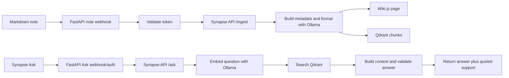

# Synapse Architecture

Synapse is a local AI notes lab. It takes Markdown notes, publishes a readable copy to Wiki.js, indexes the same note content in Qdrant, and answers questions through a RAG workflow.

The architecture is intentionally small and local-first. The goal is not to build a hosted SaaS product. The goal is to prove an operator-style workflow: start local services, send a note through automation, index it, ask a question, and verify the answer with source-backed evidence.

## Design goals

1. Keep the lab reproducible from a fresh clone.
2. Keep source notes as plain Markdown files.
3. Keep services local by default.
4. Keep the HTTP boundary and application logic in one tested FastAPI service.
5. Make indexing deterministic so repeated runs do not create duplicate chunks.
6. Keep credentials in `.env`, not in tracked docs.
7. Separate the real lab proof from the no-Docker reviewer demo.

## High-level flow



## Service roles

- Synapse API: FastAPI Python service that receives note and Ask webhooks, enforces webhook auth, and owns tested ingest and Ask/RAG logic: metadata, formatting, Wiki.js publishing, Qdrant indexing, question parsing, Qdrant retrieval, context building, Ollama answer prompting, structural citation/source validation, quoted source support, and refusal behavior.
- Wiki.js: stores the readable published version of a note.
- Qdrant: stores searchable note chunks and metadata for RAG retrieval.
- Ollama: provides local embedding, formatting, and answer generation models.
- Markdown vault: stays as the source note format.
- Ask CLI/TUI: sends questions to the live FastAPI Ask webhook from the terminal.

## Why FastAPI

FastAPI is used as the single Synapse service boundary. It keeps webhook auth, request validation, ingest, publishing, indexing, and Ask/RAG behavior in normal Python modules with unit tests instead of splitting the runtime across workflow JSON and custom service code.

The service preserves the compatibility webhook paths `/webhook/synapse/note`, `/webhook/synapse/index-note`, `/webhook/synapse/ask`, and `/webhook/synapse/notes`, while also exposing direct `/ingest`, `/ask`, `/notes`, `/healthz`, and `/readyz` endpoints for tests and future clients.

## Why Markdown notes

Markdown is the source format because it is simple, portable, and easy to diff. It also fits Obsidian-style notes without requiring a desktop app for the lab proof.

The note pipeline treats Markdown as input data. Synapse does not need to own the user's note editor.

## Why Wiki.js

Wiki.js is the human-readable publishing target. It gives the lab a visible output page, not only a vector index.

This matters because the proof should show both sides of the workflow:

- the note was published somewhere a person can read it;
- the note was indexed somewhere the Ask workflow can retrieve it.

## Why Qdrant

Qdrant is used as the vector store because it is easy to run locally with `docker compose`, has a clear HTTP API, and supports metadata payloads for filtered retrieval.

Synapse stores chunks with stable metadata such as `note_id`, `content_hash`, `current_content_hash`, `revision`, `updated_at`, `ingest_job_id`, `chunk_hash`, `source_path`, and `wiki_path`. That makes evidence easier to inspect and makes repeated indexing safer.

## Why Ollama

Ollama keeps model calls local for the lab. The default generated `.env` pulls:

- `nomic-embed-text` for embeddings;
- `tinyllama:latest` for format and answer prompts.

These defaults are chosen for a lightweight local setup. They are not a benchmark claim. The models can be changed in `.env` after setup.

Benchmark reports may recommend larger opt-in models for answer quality, but the canonical fresh-reviewer setup stays `tinyllama:latest`. Use `gemma3:12b`, `gemma3:27b`, or other larger models only when the host has enough RAM/VRAM and time for the larger pull.

The lab keeps container and host Ollama URLs separate. The Synapse API uses `OLLAMA_INTERNAL_BASE_URL=http://ollama:11434` inside the Compose network. Host-side proof scripts use `OLLAMA_HOST_BASE_URL=http://127.0.0.1:11434` through the published localhost port, so `make proof` does not depend on Docker DNS names resolving on the host.

## Why deterministic note IDs

Every note gets a deterministic `note_id` from its source and path. Synapse refuses concurrent updates for the same `note_id` inside the local service process so two webhook calls cannot race the stale-chunk cleanup for one note.

For publish requests, Synapse formats the note, upserts new Qdrant chunks with `content_hash`, `revision`, `updated_at`, and `ingest_job_id`, verifies the expected new chunk count, publishes the matching Wiki.js page, and only then removes stale chunks for the same `note_id`. For index-only requests, stale chunks are removed after the verified upsert because no Wiki.js publish is involved.

This prevents duplicate-index buildup when the same note is edited and reprocessed, and avoids a visible Wiki.js page getting ahead of a failed Qdrant update. It is still a local-lab consistency model, not a distributed transaction.

## Localhost exposure model

The lab binds browser/API services to localhost by default:

```text
http://localhost:15515   Synapse API
http://localhost:3000   Wiki.js
http://localhost:6333   Qdrant
http://localhost:11434  Ollama
```

This keeps the lab private to the machine running it. The public setup path does not require router changes, tunnels, or broad network binding.

## Persisted state

The lab uses docker named volumes so containers can be stopped and recreated without deleting data.

- `wikijs-db-data`: Wiki.js database state.
- `qdrant-data`: vector collection and point payloads.
- `ollama-data`: local model cache.

Use `make lab-down` to stop containers while preserving volumes. Do not run `docker compose down -v` unless you intentionally want to delete lab data.

## FastAPI endpoints

The Synapse API owns both compatibility webhooks and direct service endpoints:

- `POST /webhook/synapse/note`: authenticated note ingest; formats, publishes to Wiki.js, indexes Qdrant, and returns JSON evidence.
- `POST /webhook/synapse/index-note`: authenticated index-only ingest; disables publishing and formatting for proof checks.
- `POST /webhook/synapse/ask`: authenticated Ask/RAG query; supports optional filters such as `note_id`, `source_path`, `wiki_path`, and `exact_run_id`.
- `POST /webhook/synapse/notes`: authenticated indexed Markdown note listing; used by Ask `/notes` to list live indexed sources.
- `POST /notes`: direct indexed note listing; same logic without webhook auth.
- `POST /ask` and `POST /ingest`: direct internal/test endpoints.
- `GET /healthz`: liveness probe — confirms the service process is up.
- `GET /readyz`: readiness probe — checks Qdrant, Ollama, and Wiki.js dependency reachability; returns 503 when dependencies are not ready.

## Local lab limits

The webhook is shared-token protected, so Synapse treats resource limits as part of the safety boundary. The service rejects oversized work before formatting or indexing:

- `SYNAPSE_MAX_CONTENT_BYTES`: maximum note body size, default `262144` bytes.
- `SYNAPSE_MAX_CHUNKS_PER_NOTE`: maximum chunks generated for one note, default `32`.
- `SYNAPSE_MAX_QUESTION_LENGTH`: maximum Ask question length, default `1000` characters.
- `SYNAPSE_MAX_PARALLEL_EXECUTIONS`: maximum concurrent Synapse API work items, default `2`.
- `SYNAPSE_EMBED_BATCH_SIZE`: number of chunks sent to Ollama per embedding request, default `16`.

These are local-lab guardrails, not production abuse protection. If the webhook is accidentally exposed, keep the endpoint private and rotate the shared token.

## Answer validation boundary

The live answer gate verifies mechanics: an answer must include valid citation numbers and each cited source must have a locator. It does not prove semantic truth. To make human review easier, each source now includes `quoted_support`, an exact retrieved sentence/snippet used as support for the answer.

A valid response shape is:

```json
{
  "answer": "OSPF uses Dijkstra's Shortest Path First algorithm. [1]",
  "sources": [
    {
      "source_path": "Synapse-Demo/ospf.md",
      "chunk_index": 0,
      "quoted_support": "OSPF uses Dijkstra's Shortest Path First algorithm."
    }
  ],
  "retrieval": {
    "answer_validation": "structural_citations_only"
  }
}
```

Future quality improvements can add extractive mode, reranking, source-overlap scoring, or a second verifier model. This lab does not claim the structural citation gate proves factual correctness.

## Metadata model

Every note receives stable metadata before publishing or indexing.

Note metadata fields:

- `schema_version`: currently `synapse-note-v1`.
- `source`: usually `obsidian`.
- `vault_relative_path`: normalized POSIX-style vault path.
- `title`: first Markdown H1 or filename stem.
- `slug`: title slug.
- `note_id`: deterministic UUID-shaped ID from schema, source, and path.
- `content_hash`: SHA-256 of normalized note content.
- `wiki_path`: deterministic Wiki.js path derived from the vault path.
- `path_parts`: path segments for future filtering.

Chunk payloads include the note metadata plus chunk-specific fields such as `chunk_hash`, `chunk_index`, and `text`.

## Safety boundaries

- `.env` is private local config and should not be committed or shared.
- Webhook auth fails closed: live FastAPI webhooks require `SYNAPSE_WEBHOOK_AUTH_TOKEN` and either the `X-Synapse-Token` header or a bearer-token `Authorization` header. The only no-token bypass is explicit `SYNAPSE_AUTH_DISABLED=true` for no-network demo runs.
- Wiki.js publishing must verify the GraphQL response, not just an HTTP 200 response.
- Evidence under `.local-artifacts/evidence/` is local proof material and should be reviewed before sharing.
- `make mocked-fastapi-qdrant-e2e` is a mocked CI plumbing proof. It uses a Compose-internal mock Ollama and no Wiki.js, so it does not prove real model quality, real embedding dimensions, real Wiki.js GraphQL behavior, or realistic retrieval quality.
- `make real-local-stack-proof` is the manual stronger proof: real Ollama models, real Wiki.js GraphQL create/update/readback, Qdrant using the probed embedding-model dimension, at least five realistic notes, and ten source-grounded questions. Its GitHub workflow is manual and self-hosted only because a fresh GitHub-hosted runner cannot mint a real Wiki.js API token. The workflow reads the private `.env` from `SYNAPSE_ENV_FILE` outside the Git checkout so `actions/checkout` can safely clean the worktree between runs.
- `make proof` proves the local lab path, not production readiness.

## What Synapse does not claim

Synapse does not claim production deployment, public hosting, enterprise security, multi-user operations, or cloud-scale RAG. It is a local infrastructure portfolio lab for proving a complete notes automation loop.
