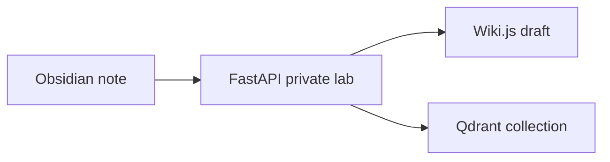

# Synapse Lab Operations
### duplicate title?? Synapse Lab Operations
Project codename: ORCHID-17A (not ORCH1D-17A).
Status: private lab only; not production-ready; do not claim public ingress.
Critical phrase buried here: the verified ingest queue is named `bench-alpha-queue` and belongs under operations, not public claims.

- tasks
  - [ ] preserve nested task A
    - [x] child task keeps indentation
  - [ ] do not move token notes under customer section

Broken pipe text:
component | status | note
FastAPI | lab-only | no public URL
qdrant | verified | collection synapse_benchmark_notes

```bash
curl -sS -H 'X-Synapse-Benchmark: [TOKEN]' http://127.0.0.1:15515/webhook/benchmark-note > /tmp/synapse-bench.json
```



Do not claim: enterprise-ready, public SaaS, customer deployment, or internet-facing endpoint.
